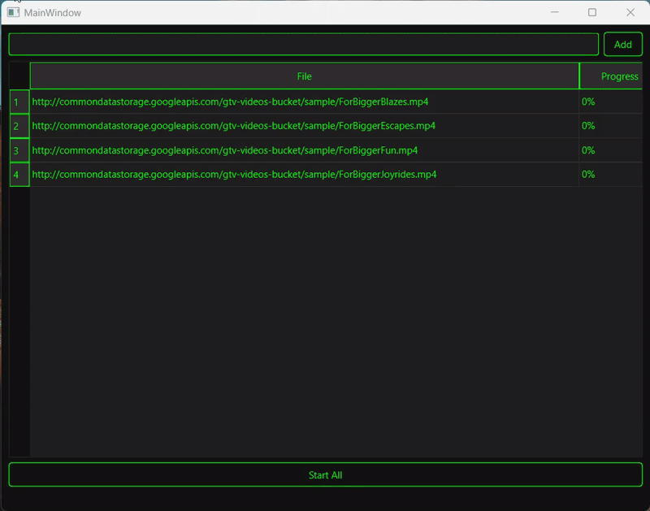

# 📥 DownloaderUI

A simple Qt6 desktop app that downloads multiple files in parallel with a clean, dark‑neon GUI.

  
  
  

  <!-- after you upload assets/demo.gif -->
  

---

## ✨ Features

- 🚀 **Multithreaded** downloads (each file in its own Qt thread)  
- 📋 **Queue** any number of URLs before starting  
- 📊 **Live progress** shown per file in a table (0–100% or “Downloading…”)  
- 🎨 **Dark neon theme** inspired by the Qt installer  
- 🌐 **Cross‑platform**: Windows, Linux, macOS  

---

## 🤔 How It Works

1. **Control Center (MainWindow)**  
   - You type or paste a URL into the input box and click **Add**.  
   - Each click adds a new row to the table: left cell shows the URL, right cell starts at `0%`.  
   - When you click **Start All**, every queued download begins simultaneously.

2. **Helper Robots (DownloadWorker threads)**  
   - For each URL, the app creates a `DownloadWorker` (subclass of `QThread`).  
   - In its `run()` method, each worker:  
     • Builds its own `QNetworkAccessManager` in its thread.  
     • Sends an HTTP GET request.  
     • Listens for `downloadProgress(bytesReceived, bytesTotal)`:  
       – If the total is known, computes a percentage and reports it back.  
       – Otherwise reports “Downloading…” until done.  
     • On `finished()`, reads all data, writes it to `downloads/<filename>`, and signals completion.

3. **Signals & Slots**  
   - Workers `emit progress(id, percent)` → MainWindow `handleProgress(id, percent)` updates the table cell.  
   - Workers `emit finished(id, filename)` → MainWindow `handleFinished(id, filename)` swaps the URL for the saved filename and marks **Completed**.

4. **Shutdown**  
   - On exit, MainWindow waits (`wait()`) for all workers to finish, then cleans up threads and UI.
